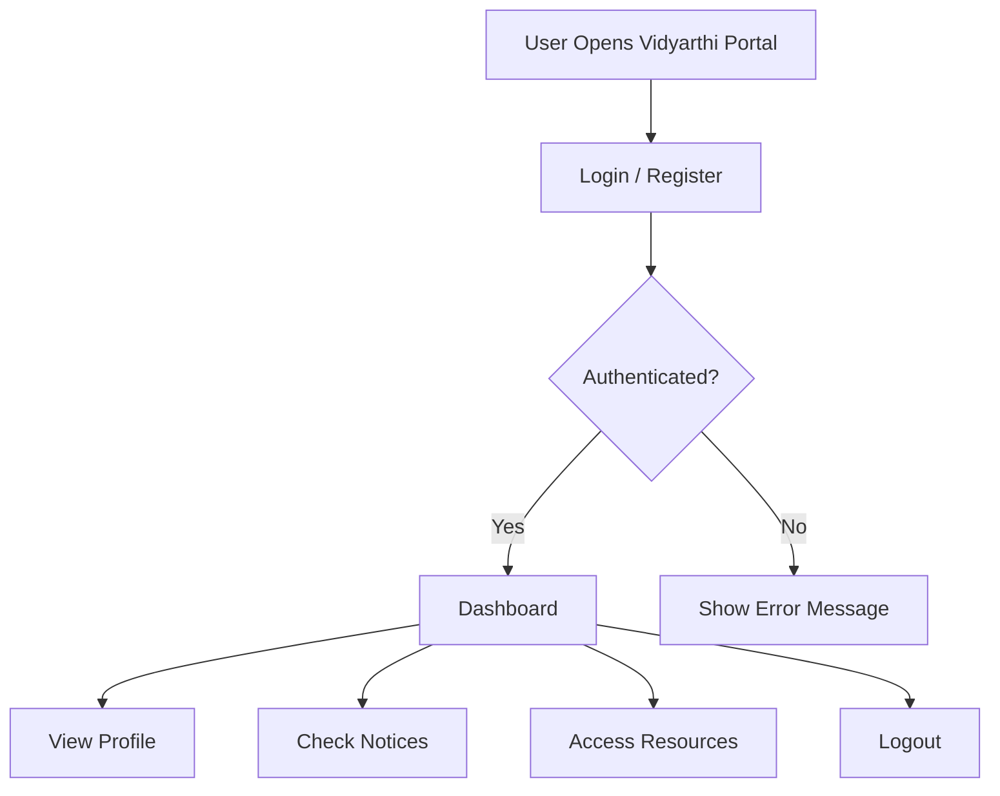

# 🎓 Vidyarthi Portal

A **student-friendly web portal** designed to help students manage academic activities such as announcements, resources, profiles, and other student services.  
Built with a clean UI and modern web technologies.

---

## ✨ Features

✅ Student Login / Registration  
✅ Dashboard Interface  
✅ Student Profile Management  
✅ Notices / Announcements  
✅ Course / Resource Section  
✅ Responsive UI (Mobile + Desktop)  
✅ Secure Authentication  
✅ Admin Management (if added)

---

## 🛠 Tech Stack

| Technology | Used For |
|----------|----------|
| React.js | Frontend UI |
| Node.js | Backend runtime |
| Express.js | Backend framework |
| MongoDB | Database |
| Mongoose | Database ORM |
| JWT | Authentication |
| CSS / Tailwind | Styling |

---

## 📌 Project Workflow

🧩 System Architecture
graph LR
    A[Frontend - React] -->|API Requests| B[Backend - Node + Express]
    B -->|Mongoose Queries| C[(MongoDB Database)]
    B -->|JWT Auth| A

📂 Folder Structure
Vidyarthi_Portal/
│── client/                # Frontend (React)
│   ├── src/
│   ├── public/
│   └── package.json
│
│── server/                # Backend (Node + Express)
│   ├── routes/
│   ├── models/
│   ├── controllers/
│   ├── middleware/
│   └── server.js
│
│── .gitignore
│── README.md
│── package.json

⚙️ Installation & Setup
🔹 1. Clone the Repository
git clone https://github.com/Santhoshi2124/Vidyarthi_Portal.git
cd Vidyarthi_Portal

🔹 2. Install Dependencies
For Backend:
cd server
npm install

For Frontend:
cd ../client
npm install

🔐 Environment Variables

Create a .env file inside server folder:

PORT=5000
MONGO_URI=your_mongodb_connection_string
JWT_SECRET=your_secret_key

▶️ Run the Project
Start Backend Server
cd server
npm start

Start Frontend
cd client
npm start

Now open in browser:
👉 http://localhost:3000
📸 Screenshots

📌 Add screenshots here:

Login Page

Dashboard

Notices Page

Profile Page

Example:

🔥 Future Enhancements

🚀 Attendance Tracking
🚀 Result / Marks Upload
🚀 Admin Panel
🚀 Chatbot Assistant
🚀 Notification System (Email/SMS)
🚀 Role-Based Access (Admin / Student / Teacher)
